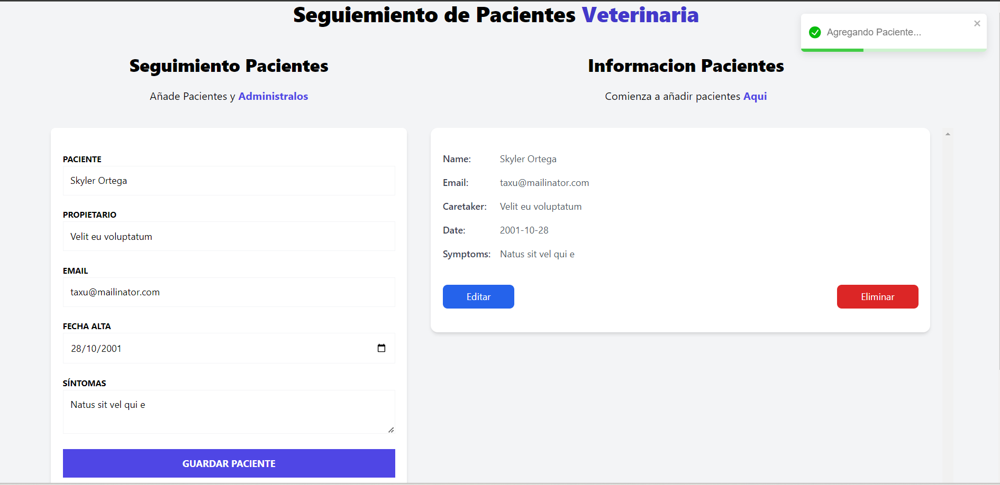

# 🐾 Aplicación de Citas Veterinarias Y Recetas

Bienvenido a la **Aplicación de Citas Veterinarias**. Esta aplicación permite a los usuarios gestionar citas para sus mascotas con veterinarios de manera sencilla. Además, incluye una sección para explorar recetas de cócteles y bebidas. Desarrollada con tecnologías modernas como TypeScript, Zustand, Tailwind CSS y React Hook Form, la aplicación combina facilidad de uso con una interfaz eficiente y atractiva.




## 🌐 Acceso a la Aplicación

Puedes acceder a la aplicación en el siguiente enlace:

[Aplicación de Citas Veterinarias y Recetas](https://dapper-rabanadas-614251.netlify.app/)

## 🛠️ Tecnologías Utilizadas

- **TypeScript** - Para el chequeo de tipos estático y una mejor experiencia de desarrollo.
- **React Hooks** - Simplifica la lógica de los componentes con hooks como `useState` y `useEffect`.
- **Zustand** - Solución ligera de gestión de estado con un patrón similar a Redux.
- **Tailwind CSS** - Framework CSS de utilidad para una interfaz de usuario receptiva y personalizable.
- **React Hook Form** - Maneja la validación y envío de formularios de manera sencilla.
- **React Toastify** - Proporciona notificaciones personalizables y atractivas.
- **React Router** - Para gestionar la navegación entre las diferentes páginas de la aplicación.
- **Lazy Loading** - Mejora el rendimiento cargando componentes de manera diferida solo cuando son necesarios.
- **Interceptors con Loading** - Gestiona el estado de carga para cada petición HTTP, proporcionando una mejor experiencia de usuario.

## 🚀 Funcionalidades

- 📅 **Reserva de Citas**: Agenda una cita para tu mascota con solo unos clics.
- 🐾 **Gestión de Mascotas**: Administra los detalles de tus mascotas, como nombre, edad y más.
- 📧 **Notificaciones**: Recibe notificaciones sobre tus citas y recordatorios a través de Toastify.
- 🍹 **Recetas de Cócteles**: Accede a una sección dedicada para ver recetas de cócteles y bebidas, con detalles sobre ingredientes y métodos de preparación.


## 📦 Instalación

1. Clona este repositorio: 
   ```bash
   git clone https://github.com/tuusuario/veterinary-appointment-app.git
